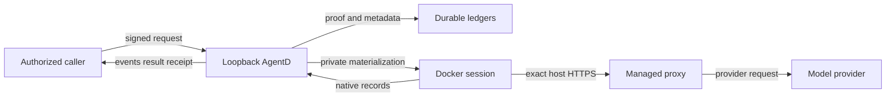

# AgentD post-v2.2 design notes

Status: **design only; owner review is required before implementation**

These notes preserve the existing v1 event/result/receipt/replay contract. They
do not authorize a new endpoint, SDK dependency, private-data migration, or
credential flow.

## Assumptions and review questions

- AgentD remains an execution data plane. It never owns portfolio state,
  evidence truth, mandates, approvals, orders, or financial journals.
- The initial private caller is a local control plane on the same host, but the
  protocol must be caller-neutral and must not encode Trading Floor concepts.
- Private prompts and artifacts may contain credentials, personal data, or
  market-sensitive information; a daemon-wide bearer token is not sufficient
  proof of authority to submit that work.
- Docker is the only restart-recoverable and private-work-eligible runtime.
  Local processes remain explicitly unsupported for those claims.
- Internet exposure, cross-host admission, and multi-tenant hosting are out of
  scope for the first version.

Questions that materially affect a later implementation review:

1. Is the private caller intentionally in the same OS user account as AgentD,
   or can a separate Unix identity and socket ownership boundary be required?
2. Must private prompt/artifact bodies be encrypted at rest, or must AgentD
   avoid persisting them entirely and require resupply for explicit resume?
3. Is one registered caller key enough initially, or must key rotation and
   multiple independently scoped callers ship in the first version?

## A. Provider headless/SDK adapter migration

### Goal and invariant

Replace CLI/PTTY or stdout-line parsing behind the runtime boundary with each
vendor's supported headless or SDK surface, while leaving these externally
observable authorities unchanged:

- `/api/v1` request and response shapes;
- event schema `1.0`, event IDs, sequences, streams, `raw_base64`, and hashes;
- stored-then-live replay and restart gap behavior;
- `output.final` bytes and hash linkage;
- terminal result and immutable receipt semantics; and
- bearer, loopback, origin, policy, and credential behavior.

The current seams are already close to the desired boundary:
`pkg/nativeprotocol.Transport` owns start/bootstrap/send/interrupt/events/wait,
`pkg/nativeprotocol.Adapter` owns provider encoding and decoding, and
`pkg/eventstream.Broker` is the only append/publish authority. SDK types must
not cross those interfaces.

### Proposed adapter shape

Keep `nativeprotocol.Transport` as the canonical entry point. Add implementations
behind it rather than creating a second execution path:

- `StreamTransport`: the retained CLI/app-server compatibility implementation.
- `HeadlessTransport`: a vendor SDK client wrapped as `Transport`.
- One provider codec per provider converts vendor callbacks into the existing
  canonical provider-record representation before the broker sees them.

Every transport output must still become a `nativeprotocol.Record` with a
provider, stream, ordinal, timestamp, and exact `Raw` bytes. For an SDK that
does not expose original wire bytes, AgentD must use a versioned deterministic
record encoder whose fixtures are frozen before rollout. Downstream derivation,
event ID allocation, hashing, persistence, replay, and wire serialization stay
unchanged. A vendor object must never be marshalled ad hoc in API handlers.

The adapter capability should be explicit and selectable, for example:

```json
{
  "provider_surfaces": {
    "version": "1.0",
    "claude": ["cli_stream_v1"],
    "codex": ["app_server_v1"]
  }
}
```

A future SDK surface is additive. There is no silent fallback between surfaces
after admission: the selected surface, provider SDK version, deterministic
record-codec version, and resume support are canonical manifest fields covered
by the request/effective-policy hash.

### Structured-output validate-and-retry

Retry is new execution authority and therefore requires a new execution-policy
version. Policy `2.1` keeps its current one-attempt behavior.

The new policy must bind:

- maximum attempts and total wall-clock/model-token budget;
- which validation failures are retryable;
- the fixed repair instruction template version; and
- whether the provider supports schema-native generation or adapter repair.

Each attempt is staged before the durable event broker. The adapter buffers a
bounded candidate turn, validates its final bytes with the current
`structuredResultCollector`, and only publishes the accepted attempt through
the existing broker. Rejected candidate text, repair prompts, and credentials
are neither public events nor diagnostic logs. If the process or daemon fails
before an attempt is accepted, the outcome is `indeterminate`; AgentD must not
invent a successful retry.

On success, the accepted attempt produces the same event vocabulary,
`output.final`, hash headers, and receipt linkage as today. On exhausted retry,
the existing typed `session.structured_output_invalid` or
`session.structured_output_too_large` terminal behavior remains authoritative.
No second result type is introduced.

This buffering trades immediate token streaming for contract stability. If
streaming rejected attempts is later desired, that requires a new event-schema
version and is outside this design.

### Session resume

The durable generation continues to store only the opaque provider session or
thread ID. `Bootstrap` maps generation start to SDK create and explicit resume
to SDK resume. The adapter must prove:

- create returns one stable provider ID and binds it exactly once;
- reconnect to a still-running generation does not create or resume a new
  provider session;
- explicit AgentD resume creates generation `N+1` and uses the stored provider
  ID only after the caller regrants required secrets; and
- an unsupported or ambiguous SDK resume becomes typed `indeterminate`, never
  a fresh hidden conversation.

SDK state is not recovery authority. The durable session/generation/event
ledger and Docker identity remain authoritative.

### Migration gates

1. Freeze golden fixtures for Claude and Codex covering raw records, derived
   payloads, event JSON bytes, hashes, result bytes, and receipts.
2. Run every implementation through one transport contract suite: start,
   schema bootstrap, prompt, steer, interrupt, terminal wait, reconnect, resume,
   cancellation, backpressure, malformed frames, and credential non-leakage.
3. Run old and new transports against recorded provider fixtures and require
   byte equality after the canonical-record boundary.
4. Fault-inject every commit boundary: provider accepted/input unacknowledged,
   accepted output/event uncommitted, event committed/live unpublished, and
   terminal event/receipt finalization.
5. Advertise the new surface only after real Docker create, restart/reconnect,
   explicit resume, structured retry, egress, and resource qualification pass.
6. Roll out by exact release plus capability selection. Never infer the new
   adapter from binary version and never fall back after admission.

Primary review paths: `pkg/nativeprotocol/`, `pkg/api/native_sessionio.go`,
`pkg/api/structured_output.go`, `pkg/api/runtime_resolver.go`,
`pkg/eventstream/`, and `pkg/api/recovery.go`.

## B. Authenticated private-work admission

### Executive summary

The highest risks are misuse of the daemon-wide bearer by another local
process, authority widening through a signed-but-different manifest, private
data leakage into durable/diagnostic surfaces, and replay of an otherwise valid
admission. The first private surface should remain loopback-only and require a
versioned, caller-signed, single-use admission proof bound to the exact request,
AgentD build, policy, namespace, and expiry. Public canary authentication and
result proof remain necessary but are not sufficient.

### Scope and assumptions

In scope: a future versioned private admission endpoint, caller identity and
authorization, proof replay prevention, private payload handling, Docker
materialization, event access, and acceptance evidence. Existing public v1
admission remains unchanged.

Out of scope: remote internet admission, workflow scheduling, trading
authorization, source approval, evidence acceptance, broker access, portfolio
state, and implementation in this release.

The unanswered deployment questions are listed at the top of this document.
Because the owner requested an autonomous design-only pass, the threat ratings
below use the conservative same-user/loopback assumptions and must be revisited
before code is approved.

### System model

#### Primary components

- Caller control plane with an owner-approved signing key.
- Loopback AgentD API with existing bearer authentication plus new private
  proof verification and authorization.
- Durable admission/replay ledger and a separate anti-replay proof ledger.
- Docker runtime, private materialization, exact-host proxy, and provider.
- Immutable v1 events/results/receipts plus a separate signed private-admission
  acceptance record.

#### Data flows and trust boundaries

- Caller → AgentD: private request, bearer, and signed admission assertion over
  loopback HTTP. AgentD verifies bearer, signature, canonical body hash, expiry,
  nonce, namespace, allowed policy, and exact build before durable admission.
- AgentD → durable stores: non-secret manifest, proof hash/key ID, nonce use,
  generations, events, and receipts. Private bodies are encrypted or omitted;
  credentials are never persisted in these records.
- AgentD → Docker: decrypted prompt and explicitly granted credentials through
  stdin/private `0600` files, plus hash-covered execution policy. No secret is
  placed in argv, labels, environment retained by Docker, or proxy config.
- Docker → managed proxy → provider: HTTPS CONNECT only to exact policy hosts;
  direct DNS/IP egress remains unavailable.
- AgentD → caller: existing v1 event/result/receipt contract plus a separate
  signed admission acceptance that binds caller proof, request hash, build,
  policy hash, session ID, generation, and timestamp.

#### Diagram



### Required proof beyond the public canary

The public canary proves exact release/commit, loopback bearer enforcement,
public policy/hash equality, credential non-leakage, and event/result/receipt
linkage. Private admission additionally needs all of the following:

1. **Caller identity:** an owner-registered Ed25519 key ID and signature. The
   registry and private keys are regular owner-only `0600` files; capabilities
   advertise public fingerprints, never key material.
2. **Fresh intent:** a cryptographically random request nonce, issued-at and
   short expiry, consumed atomically in a durable anti-replay ledger.
3. **Exact request binding:** a deterministic canonical assertion containing
   the HTTP body SHA-256, idempotency key, requested AgentD version/commit,
   private-policy version/hash, provider/model, runtime, workspace profile,
   resource limits, egress hosts, tool grants, credential-grant names, caller
   namespace, privacy classification, and retention class.
4. **Authorized scope:** the registered key policy must permit every asserted
   field. AgentD intersects nothing and fills no authority-bearing defaults;
   omitted authority fails admission.
5. **Server acceptance:** a separate AgentD-signed admission record binds the
   verified caller assertion to the durable session/generation and the exact
   running build. It does not modify the existing terminal receipt schema.
6. **Private-data handling:** the prompt/body is bound by hash but excluded
   from ordinary request manifests, logs, events, errors, capability data, and
   labels. Owner review must choose encrypted persistence or no persistence.

Use deterministic canonical JSON or a fixed binary schema for signing; never
sign ambiguous raw JSON. Key rotation is additive: old key IDs may verify
already-admitted immutable records but cannot submit after revocation.

The private API should be a new versioned surface (for example
`/api/v2/private/sessions`) with a `private_admission` capability version. A v1
bearer alone must receive a typed authorization failure. Public `/api/v1`
behavior and all existing canary checks stay intact.

### Assets and security objectives

| Asset | Why it matters | Objective |
|---|---|---|
| Private prompts/artifacts | May contain sensitive research or personal data | C/I |
| Caller and AgentD signing keys | Define who may submit work and what daemon accepted it | C/I |
| Provider credentials | Permit paid model access | C/I |
| Admission proof/nonce ledger | Prevents replay and confused-deputy execution | I/A |
| Execution policy and manifest hashes | Bound runtime authority | I |
| Events, results, receipts | Canonical execution evidence | I/A |
| Docker/proxy boundary | Contains untrusted model/tool execution | C/I/A |
| Exact release identity | Lets callers reject unreviewed behavior | I |

### Attacker model

Capabilities:

- A malicious local process may reach loopback and may steal or be passed the
  daemon-wide bearer.
- A caller may be authenticated but attempt to widen its namespace, tools,
  egress, credentials, resource limits, retention, or model.
- Provider/model output and fetched public content are untrusted and may try to
  exfiltrate data or exhaust resources.
- An attacker may replay observed requests, reorder controls, disconnect
  viewers, or trigger crash/recovery boundaries.

Non-capabilities for initial ratings:

- No direct internet route to AgentD and no valid owner signing key.
- No root/Docker-daemon compromise or host-kernel escape.
- No authority over Trading Floor evidence, trading, or broker state merely by
  controlling AgentD output.

### Entry points and attack surfaces

| Surface | How reached | Boundary | Notes | Evidence |
|---|---|---|---|---|
| HTTP session/control routes | Loopback HTTP | Caller → AgentD | Current v1 bearer is daemon-wide | `pkg/api/routes.go`, `pkg/api/auth.go` |
| Event WebSocket | Authenticated loopback WS | Caller ↔ AgentD | Same-origin browser policy; subprotocol bearer | `pkg/api/event_stream_handler.go` |
| Request/policy parser | JSON body | Caller → policy/runtime | Canonical allowlist/resources and no mounts/hooks | `pkg/api/execution_policy.go` |
| Credential grant | Request plus private file | Caller → materializer | Explicit grant; value excluded from manifest | `pkg/api/schema/credential_grants.go` |
| Durable admission | SQLite | API → ledger | Idempotent logical sessions/generations | `pkg/api/v1_session.go`, `pkg/durable/` |
| Provider transport | stdin/stdout or future SDK | Docker ↔ AgentD | Provider output is untrusted | `pkg/nativeprotocol/` |
| Egress proxy | Internal Docker network | Container → internet | Exact-host HTTPS only | `pkg/runtime/policy_network.go` |
| Diagnostic mirror | Private files | Runtime → host storage | Optional, redacted, retained | `pkg/session/logfile.go` |

### Top abuse paths

1. Steal the shared bearer → submit a private prompt under another caller's
   identity → consume credentials/model budget or expose private output.
2. Sign an innocuous manifest but send a different HTTP body → exploit parser
   ambiguity → gain tools, egress, mounts, or retention not reviewed by caller.
3. Replay a valid signed request before expiry → create duplicate paid work or
   attach controls to the wrong logical session.
4. Induce prompt/credential serialization into manifest, logs, events, errors,
   Docker labels, or proxy configuration → read it later from host artifacts.
5. Use model output or web content to request arbitrary hosts/IPs → bypass the
   provider/search allowlist → exfiltrate private context.
6. Exhaust CPU, memory, PIDs, FDs, concurrency, request body, or retry budget →
   deny service to other admitted sessions.
7. Present capabilities from an unstamped or different daemon → trick the
   caller into sending private work to unreviewed code.
8. Hijack a stream/control connection → steer or terminate another caller's
   private session → corrupt execution evidence or availability.

### Threat model table

| ID | Source | Prerequisites | Action and impact | Existing controls | Gap and recommendation | Detection | Likelihood | Impact | Priority |
|---|---|---|---|---|---|---|---|---|---|
| TM-001 | Local malicious process | Loopback access and bearer disclosure | Submit private work or read/control sessions | `0600` token, constant-time bearer check, loopback listener | Require caller signature, scoped key policy, and session-scoped stream/control grants | Alert on key/namespace mismatch and bearer-only private attempts | Medium | High | High |
| TM-002 | Authorized caller or proxy | Valid key but mismatched authority/body | Widen tools, egress, credentials, resources, or namespace | Canonical execution policy/hash and typed rejection | Sign canonical body hash plus every authority field; exact registered-policy comparison; no authority defaults | Audit proof hash and rejected field/code without private values | Medium | High | High |
| TM-003 | Local reader, operator error, or crash artifact | Private bytes reach persistence/logging | Disclose prompt, artifact, or credential | Explicit grants; diagnostic redaction/disable; private modes | Encrypt private payloads or do not persist them; forbid private bytes in manifest/events/errors/labels; adversarial leak tests | Secret canaries in qualification artifacts; mode and retention audits | Medium | High | High |
| TM-004 | Untrusted model or web content | Private context plus network-capable tool | Exfiltrate through arbitrary network destination | Internal network, mandatory proxy, exact-host allowlist, no direct DNS/IP | Private policy must use a separately reviewed exact-host set and remain hash-bound; no wildcard/private IP resolution | Proxy-denial counters without URLs/payloads; unexpected DNS attempt metrics | Low | High | High |
| TM-005 | Request observer or retrying caller | Captured valid signed assertion | Replay paid work or controls | Durable idempotency keys and immutable control ledger | Add atomic nonce consumption, expiry, caller namespace, and body-hash conflict semantics | Duplicate nonce/idempotency conflict alerts | Medium | Medium | Medium |
| TM-006 | Untrusted workload | Valid admission | Resource exhaustion or sandbox escape | Docker read-only/workspace profiles, memory/CPU/PID/FD limits, capacity gate | Private work Docker-only; bound total retry/time/output budgets; fail closed if ceilings unavailable | Per-session limit-breach, latency, and capacity metrics | Medium | High | High |
| TM-007 | Spoofed/stale daemon | Caller does not verify instance | Receive private work under wrong code/policy | Exact binary/release capability stamps | Pin AgentD instance public key and require signed acceptance binding build, capability, proof, and session | Caller rejects acceptance mismatch; log only fingerprints | Low | High | High |
| TM-008 | Browser/local process | Bearer or stream credential access | Observe, steer, interrupt, or terminate another private session | Authenticated WS subprotocol, same-origin check, durable controls | Derive short-lived session/action-scoped grants from accepted caller proof; keep bearer out of URLs | Cross-namespace control and origin rejection metrics | Medium | Medium | Medium |

### Criticality calibration

- **Critical:** unauthenticated private-work execution, host/Docker escape with
  signing-key or credential theft, or cross-namespace arbitrary session control.
- **High:** private prompt/credential exfiltration, signed-manifest authority
  widening, exact-host bypass, or spoofed-daemon admission.
- **Medium:** bounded duplicate spend, targeted per-session denial of service,
  or stream/control disruption without data disclosure.
- **Low:** non-sensitive capability metadata leakage, noisy rejected requests,
  or failures requiring both root compromise and a valid signing key.

The same-OS-user assumption raises bearer-theft likelihood. A distinct Unix
identity/private socket would reduce TM-001 and TM-008 but would not remove the
need for request signatures and exact authority binding.

### Mitigation and acceptance gates

- Add no private route until caller and AgentD keys have atomic `0600` creation,
  rotation/revocation, fingerprint capabilities, and no-log tests.
- Make signature verification, authorization, nonce consumption, and durable
  session admission one fail-closed transaction boundary. A failure before
  session creation creates no container; a failure afterward terminalizes the
  admitted identity explicitly.
- Require Docker, stamped images, policy hash, resource ceilings, exact-host
  egress, private diagnostic mode, and recovery capability `1.0` before private
  admission.
- Keep proof metadata non-secret and immutable. Never include prompt bytes,
  credential values, or decrypted artifacts in an acceptance record.
- Add negative contract tests for every field mismatch, key revocation, nonce
  replay, expired proof, wrong build, wrong namespace, body ambiguity, bearer-
  only access, stream/control cross-namespace access, crash boundary, and leak
  sink.
- Run a private synthetic canary with canary secrets in every input encoding;
  search events, receipts, manifests, logs, SQLite, Docker inspect, process
  argv/env, proxy state, and artifacts before any real private data is allowed.

### Focus paths for security review

| Path | Why | Threats |
|---|---|---|
| `pkg/api/auth.go` | Existing daemon-wide authentication and request limit | TM-001, TM-008 |
| `pkg/api/routes.go` | Versioned entry-point and middleware placement | TM-001, TM-008 |
| `pkg/api/v1_session.go` | Durable idempotency/admission transaction | TM-002, TM-005 |
| `pkg/api/execution_policy.go` | Authority canonicalization and hashing | TM-002, TM-004, TM-006 |
| `pkg/api/schema/credential_grants.go` | Secret grant boundary | TM-003 |
| `pkg/materialize/` | Private files and clean runtime context | TM-003, TM-006 |
| `pkg/durable/` | Immutable proof, nonce, event, and receipt storage | TM-002, TM-005, TM-007 |
| `pkg/runtime/docker.go` | Container identity, limits, and lifecycle | TM-006, TM-007 |
| `pkg/runtime/policy_network.go` | Exact-host egress enforcement | TM-004 |
| `pkg/api/event_stream_handler.go` | Stream authentication/origin/ownership | TM-008 |
| `pkg/session/logfile.go` | Redaction, modes, retention, disable | TM-003 |
| `cmd/agentd/main.go` | Loopback binding, key/config startup, recovery | TM-001, TM-007 |

### Quality check

- Covered HTTP, WebSocket, parsing, credential, durable store, provider,
  egress, logging, Docker, and release-identity boundaries.
- Separated runtime threats from future build/release verification and from
  tests.
- Distinguished attacker-, operator-, and developer-controlled inputs.
- Recorded assumptions and questions rather than silently choosing a private
  persistence or deployment model.
- Made every new authority versioned and additive; public v1 remains intact.
