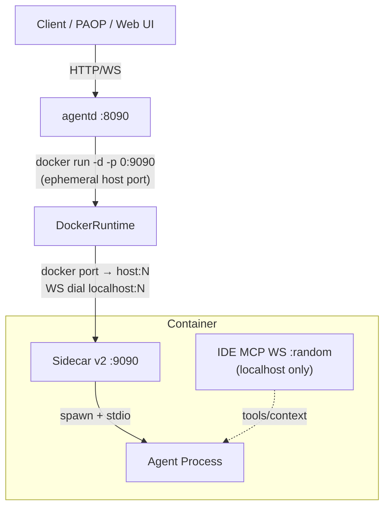
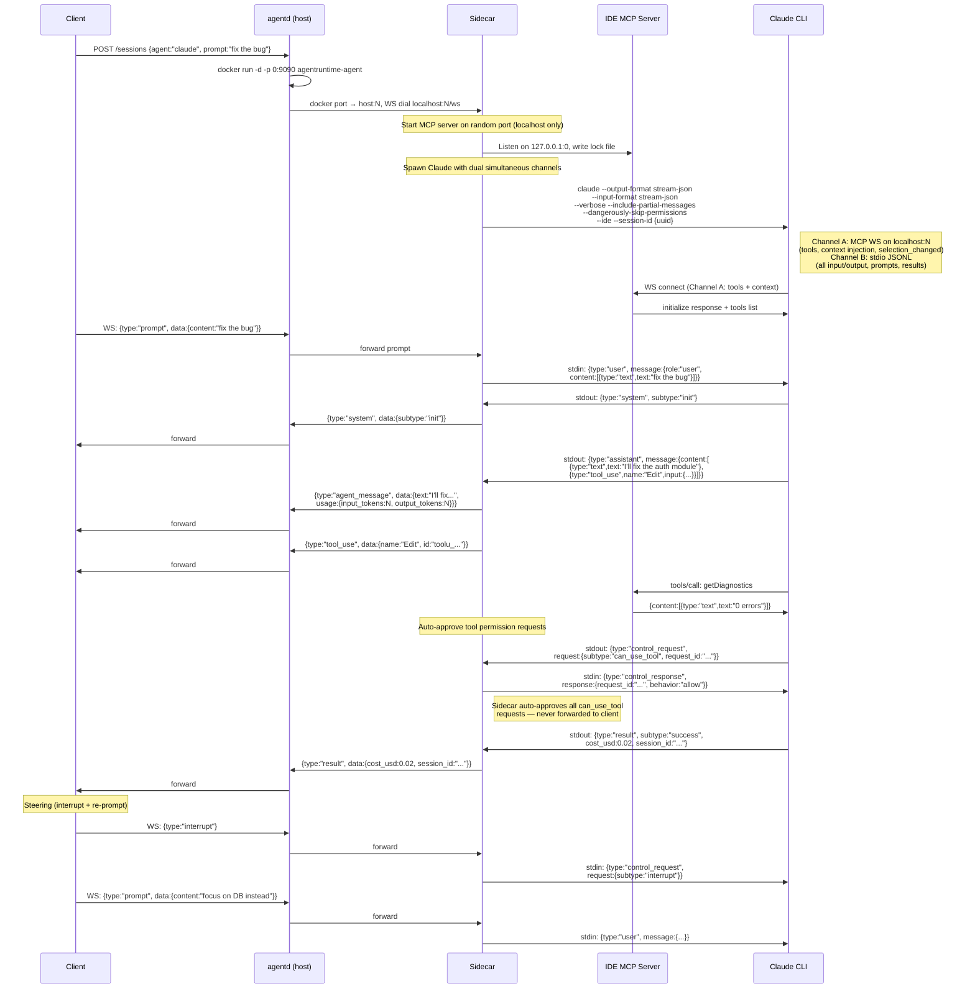
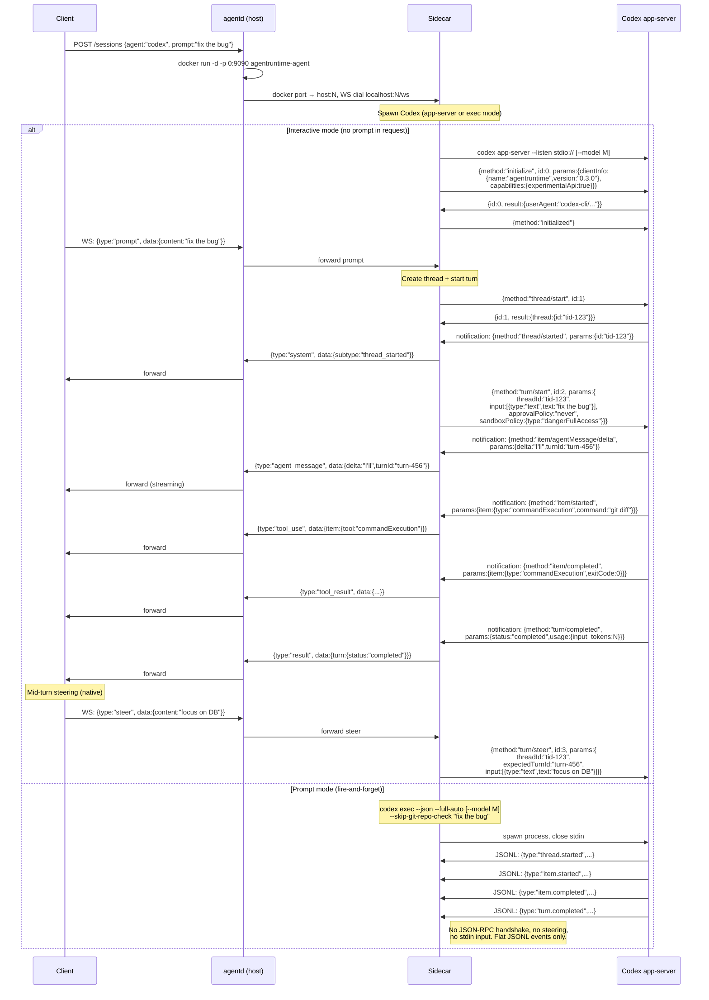
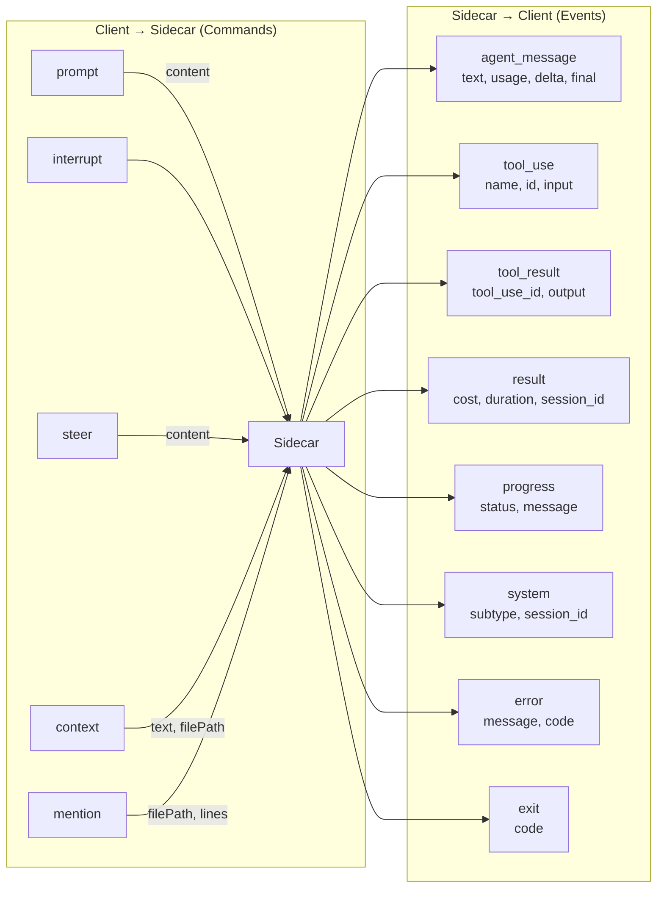

# Architecture Flow Diagrams

## System Overview



## Claude Code Flow



## Codex Flow



## Event Normalization

All agent events pass through per-agent normalization (`cmd/sidecar/normalize.go`) before reaching the external WS endpoint. Both Claude and Codex backends emit raw, agent-specific events; the sidecar's `normalizeEvent()` maps them to the standard `NormalizedAgentMessage`, `NormalizedToolUse`, `NormalizedToolResult`, and `NormalizedResult` shapes. Clients always receive the unified schema regardless of which agent produced the event.

## Unified External WS Protocol



## Container Filesystem Layout

```mermaid
graph TD
    subgraph "Host agentd"
        HD["~/.local/share/agentruntime/"]
        CS["claude-sessions/session-id/"]
        CXS["codex-sessions/session-id/"]
        LOGS["logs/session-id.ndjson"]
        CREDS["credentials/claude-credentials.json"]
    end

    subgraph "Container (/home/agent)"
        CC[.claude/ → session dir mount rw]
        CCred[.claude/.credentials.json]
        CSet[.claude/settings.json]
        CMD[.claude/CLAUDE.md]
        CMcp[.claude/.mcp.json]
        CProj[.claude/projects/hash/]
        CState[.claude.json → account state ro]

        CXC[.codex/ → session dir mount rw]
        CXAuth[.codex/auth.json]
        CXConf[.codex/config.toml]

        WS[/workspace/ → workdir mount rw]
        WSGit[/workspace/.git/ → trust bypass]
    end

    HD --> CS
    HD --> CXS
    HD --> LOGS
    CS -->|mount| CC
    CXS -->|mount| CXC
```

## Data Flow Summary

| Layer | Claude | Codex (app-server) | Codex (exec) |
|-------|--------|-------|------|
| **Spawn** | `claude --output-format stream-json --input-format stream-json --verbose --include-partial-messages --dangerously-skip-permissions --ide --session-id {uuid}` | `codex app-server --listen stdio:// [--model M]` | `codex exec --json --full-auto --skip-git-repo-check [--model M] "prompt"` |
| **Output channel** | JSONL on stdout (Channel B — simultaneous with MCP WS) | JSON-RPC notifications on stdout | Flat JSONL on stdout |
| **Input channel** | JSONL on stdin (Channel B) | JSON-RPC requests on stdin | None (stdin closed) |
| **Tool channel** | IDE MCP WebSocket on localhost:random (Channel A — simultaneous with stdio) | Same JSON-RPC channel | N/A |
| **Steering** | interrupt control_request + new user message | `turn/steer` (native) | Not supported |
| **Tool approval** | `control_request` with `can_use_tool` auto-approved by sidecar | `requestApproval` auto-accepted by sidecar | N/A (`--full-auto`) |
| **Context injection** | `selection_changed` via MCP WS | Not supported natively | Not supported |
| **Session resume** | `--session-id` (always set; `--resume` not yet wired) | `thread/resume` JSON-RPC (not yet wired) | N/A (one-shot) |
| **Auth** | OAuth via credentials.json mount | OAuth via auth.json mount | OAuth via auth.json mount |
| **Output format** | Anthropic API message objects | Codex item events with deltas | Codex flat JSONL events |
