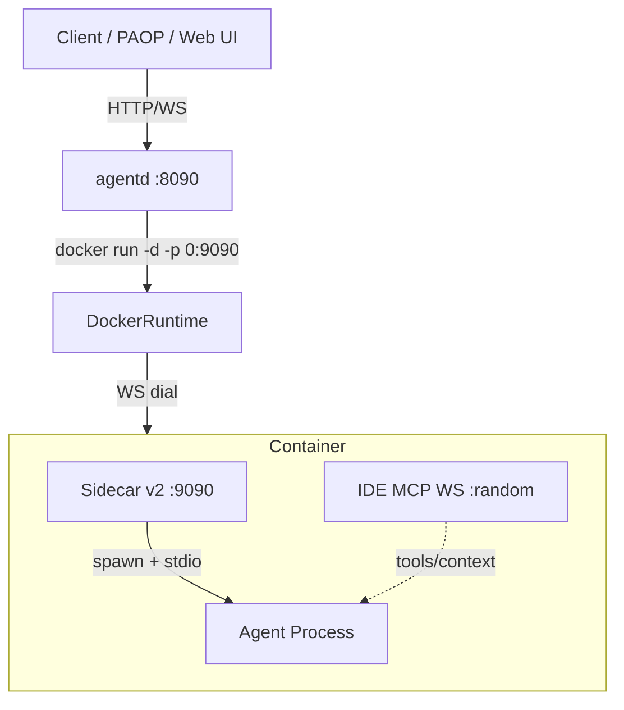
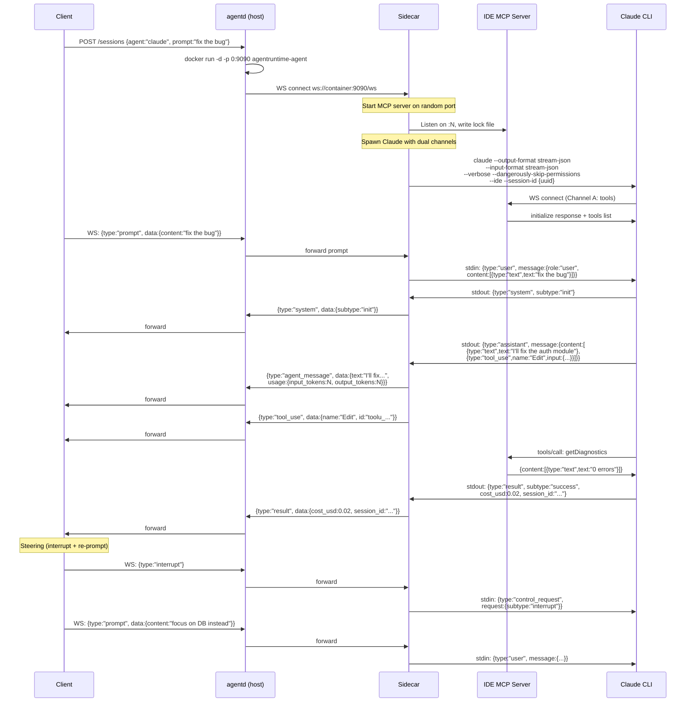
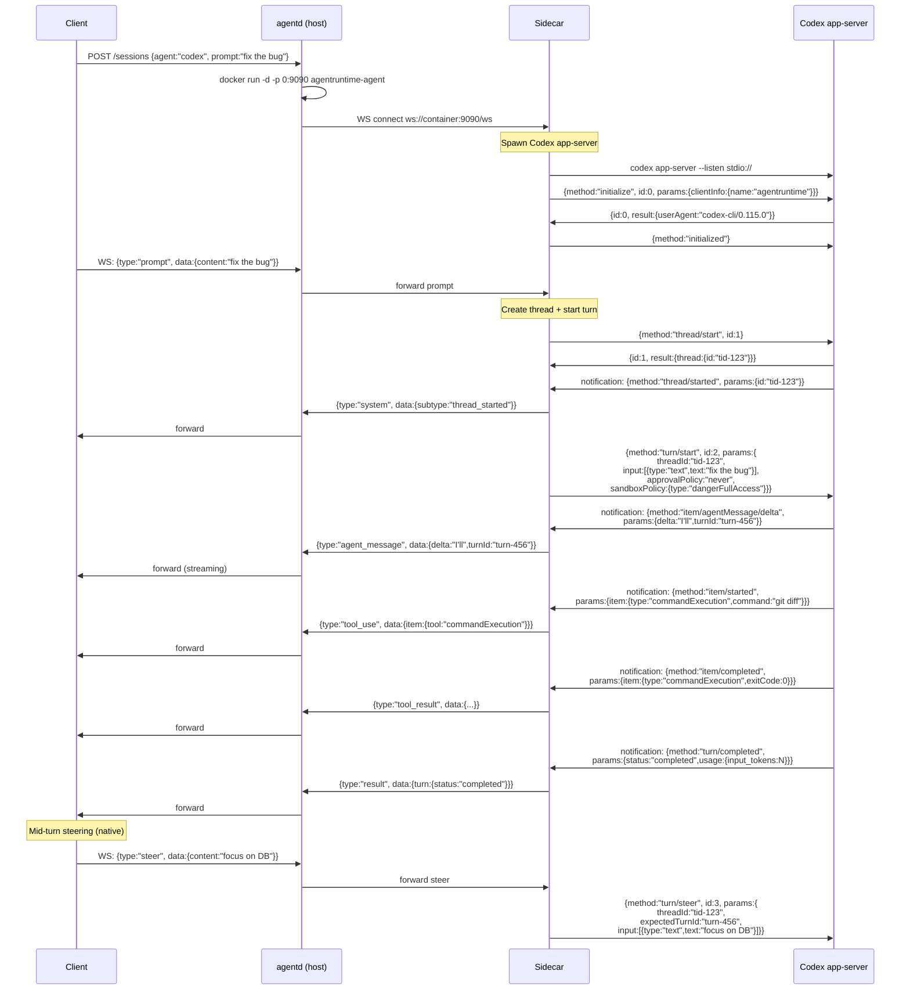
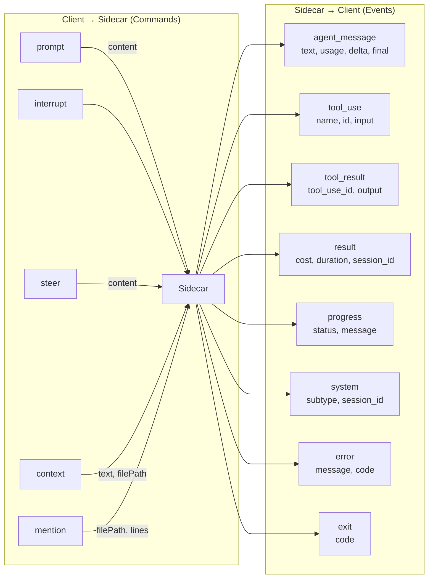

# Architecture Flow Diagrams

## System Overview



## Claude Code Flow



## Codex Flow



## Unified External WS Protocol



## Container Filesystem Layout

```mermaid
graph TD
    subgraph "Host (agentd)"
        HD[~/.local/share/agentruntime/]
        CS[claude-sessions/{session-id}/]
        CXS[codex-sessions/{session-id}/]
        LOGS[logs/{session-id}.ndjson]
        CREDS[credentials/claude-credentials.json]
    end

    subgraph "Container (/home/agent)"
        CC[.claude/ → session dir mount rw]
        CCred[.claude/.credentials.json]
        CSet[.claude/settings.json]
        CMD[.claude/CLAUDE.md]
        CMcp[.claude/.mcp.json]
        CProj[.claude/projects/{hash}/]
        CState[.claude.json → account state ro]

        CXC[.codex/ → session dir mount rw]
        CXAuth[.codex/auth.json]
        CXConf[.codex/config.toml]

        WS[/workspace/ → workdir mount rw]
        WSGit[/workspace/.git/ → trust bypass]
    end

    HD --> CS
    HD --> CXS
    HD --> LOGS
    CS -->|mount| CC
    CXS -->|mount| CXC
```

## Data Flow Summary

| Layer | Claude | Codex |
|-------|--------|-------|
| **Spawn** | `claude --output-format stream-json --input-format stream-json --ide` | `codex app-server --listen stdio://` |
| **Output channel** | JSONL on stdout (Channel B) | JSON-RPC notifications on stdout |
| **Input channel** | JSONL on stdin | JSON-RPC requests on stdin |
| **Tool channel** | IDE MCP WebSocket (Channel A) | Same JSON-RPC channel |
| **Steering** | interrupt control_request + new user message | `turn/steer` (native) |
| **Context injection** | `selection_changed` via MCP WS | Not supported natively |
| **Session resume** | `--session-id` + `--resume` | `thread/resume` JSON-RPC |
| **Auth** | OAuth via credentials.json mount | OAuth via auth.json mount |
| **Output format** | Anthropic API message objects | Codex item events with deltas |
